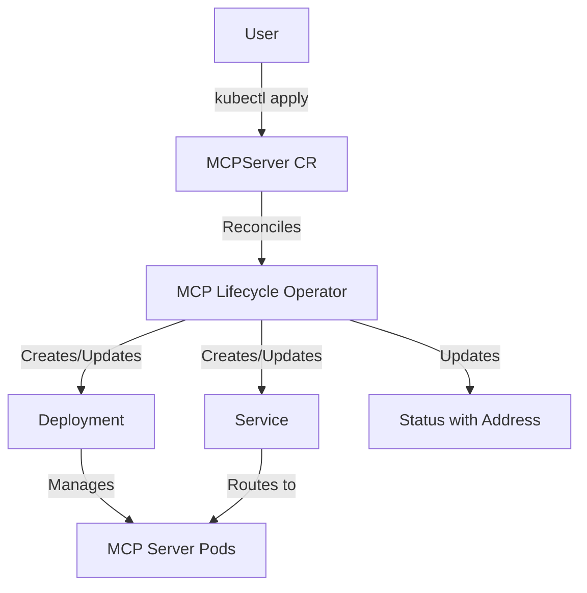

# Introduction

## What is MCP Lifecycle Operator?

The MCP Lifecycle Operator is a Kubernetes operator that automates the deployment and management of Model Context Protocol (MCP) servers. It provides a Kubernetes-native way to run MCP servers as production-ready services in your cluster.

## Goals and Objectives

The operator aims to:

- **Simplify Deployment**: Provide a declarative API for deploying MCP servers without manual Kubernetes resource management
- **Production Grade**: Include built-in health checks, security configurations, and lifecycle management
- **Kubernetes Native**: Integrate seamlessly with standard Kubernetes resources like ConfigMaps and Secrets
- **Ecosystem Integration**: Work with existing Kubernetes tools and workflows

## API Resources

### MCPServer

The core resource provided by this operator is `MCPServer`. It represents a deployed MCP server instance with the following key capabilities:

#### Source Configuration

Define where your MCP server container image comes from:

```yaml
spec:
  source:
    type: ContainerImage
    containerImage:
      ref: registry.io/mcp-server:v1.0.0
```

#### Server Configuration

Configure the server's runtime behavior:

```yaml
spec:
  config:
    port: 8081              # Server port
    env:                    # Environment variables
      - name: LOG_LEVEL
        value: info
    envFrom:                # Load env vars from ConfigMaps/Secrets
      - configMapRef:
          name: mcp-config
```

#### Storage and Mounts

Mount ConfigMaps, Secrets, or EmptyDirs:

```yaml
spec:
  config:
    storage:
      - path: /etc/mcp
        source:
          type: ConfigMap
          configMap:
            name: mcp-server-config
```

#### Health and Security

Configure health checks and security contexts:

```yaml
spec:
  runtime:
    health:
      readinessProbe:
        httpGet:
          path: /health
          port: 8081
    security:
      securityContext:
        runAsNonRoot: true
        readOnlyRootFilesystem: true
```

## Status and Discovery

The operator automatically manages the server lifecycle and provides status information:

```yaml
status:
  phase: Running                    # Current state
  deploymentName: my-mcp-server     # Created Deployment
  serviceName: my-mcp-server        # Created Service
  address:
    url: http://my-mcp-server.default.svc.cluster.local:8081/mcp
  conditions:
    - type: Ready
      status: "True"
      reason: DeploymentReady
```

The `address.url` field provides the cluster-internal URL that other workloads can use to connect to the MCP server.

## Architecture



The operator watches for `MCPServer` resources and automatically:

1. Creates a Deployment to run the MCP server containers
2. Creates a Service for network access
3. Manages updates and rollouts
4. Reports status and connection information
5. Cleans up resources on deletion

## Next Steps

- **Get Started**: Follow the [Quickstart Guide](guides/quickstart.md)
- **Examples**: Check out the [examples directory](https://github.com/kubernetes-sigs/mcp-lifecycle-operator/tree/main/examples)
- **API Reference**: See the [API documentation](reference/) for all available fields
- **Contributing**: Read the [Contributing Guide](contributing/index.md) to get involved
- **Community**: Join [SIG Apps](https://github.com/kubernetes/community/blob/main/sig-apps/README.md) meetings and discussions
